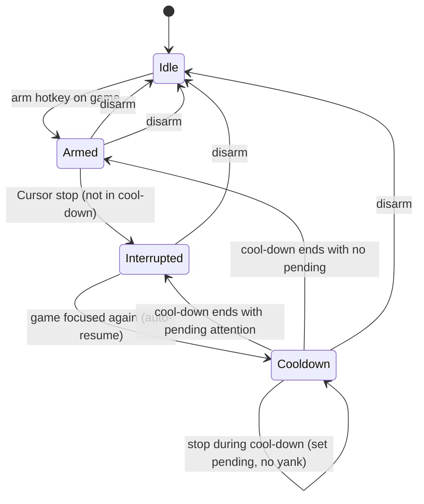
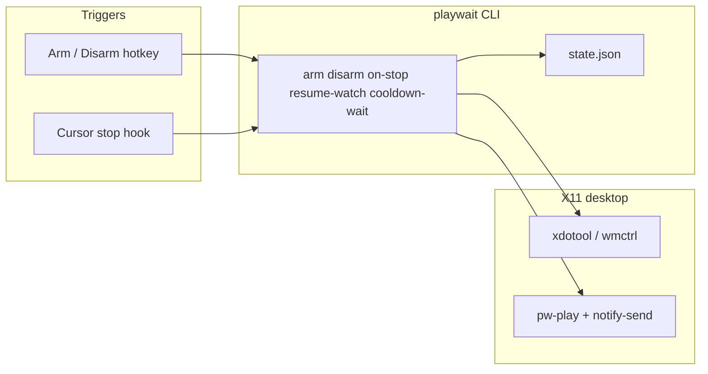
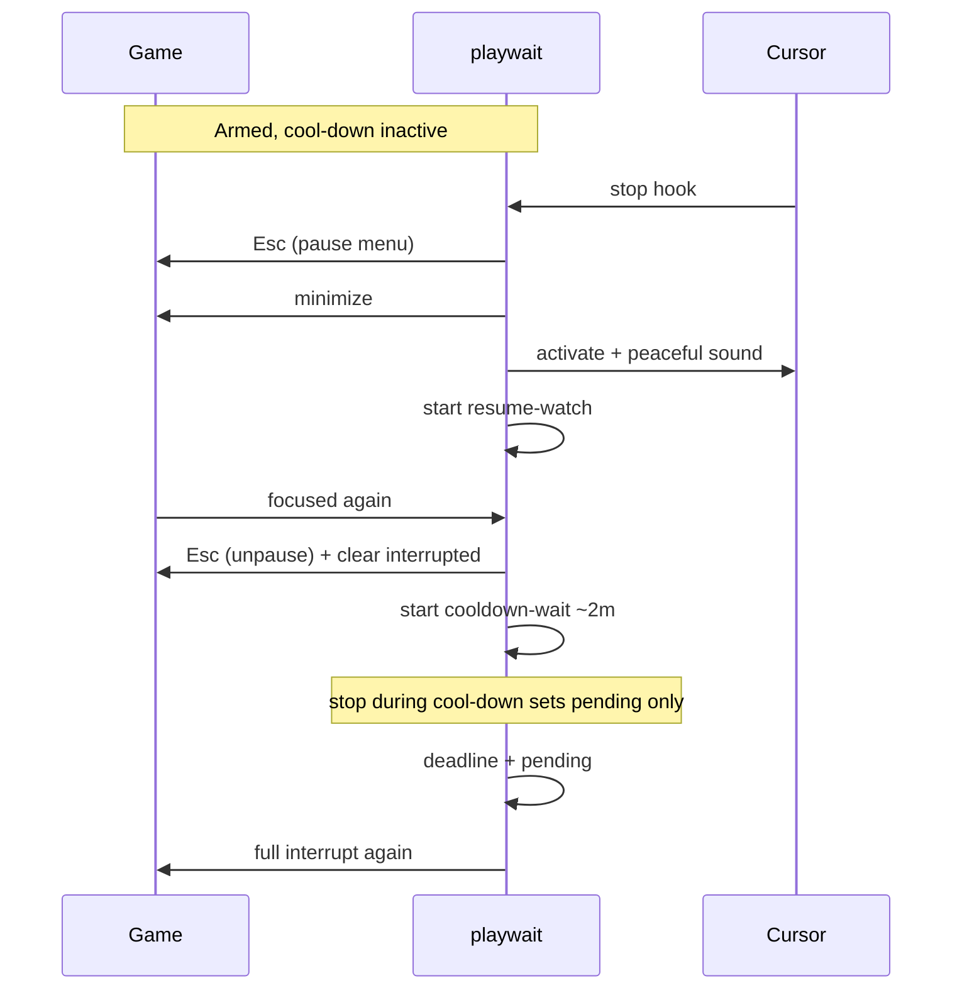

# playwait - Plan

## Goal Capsule

- **Objective:** While a Cursor agent runs in the background, keep playing a single-player game (e.g. Skyrim on Proton); when the agent finishes a turn, pause the game, bring Cursor forward with a peaceful sound, auto-resume when you return, then protect ~2 minutes of play before the next yank (with deferred yank if chat finished during cool-down).
- **Product authority:** Product Contract below (from brainstorm). Planning Contract owns HOW.
- **Open blockers:** None.
- **Implementation authority:** This plan’s Planning Contract + Implementation Units.

---

## Product Contract

### Summary

playwait is a small Ubuntu-local tool that lets you arm a game window, then on Cursor agent turn completion pause that game, raise Cursor, and play a peaceful notify sound so you notice, then auto-resume when the game regains focus. After resume, a ~2 minute cool-down blocks another yank so you are not thrashed between game and chat. v1 covers turn-end interrupts only; mid-run Allow/Deny detection is deferred.

### Problem Frame

Long Cursor agent turns leave you idle or alt-tabbing by habit. You want to progress a single-player game while waiting, then get yanked back the moment the agent is done — without missing the reply or sitting in a frozen permissionless wait that never comes (approvals are a later problem). Manual alt-tab and pause is easy to miss when immersion is high.

### Key Decisions

- **KD1. Arm on demand, not config or heuristics.** A hotkey while the game is focused marks that window as the target until disarm. Avoids brittle Proton/Skyrim window-class config and mis-latching onto Discord/browser.
- **KD2. Phase mid-run approvals out of v1.** Cursor `stop` (turn finished / waiting on chat) is the v1 trigger. Mid-run Allow/Deny remains a product goal for a later version.
- **KD3. Interrupt-spawned resume watcher.** On interrupt, start a short-lived watcher that resumes when the armed window is focused again, then exits. No always-on daemon while merely playing.
- **KD4. Own repo under the productivity folder.** Lives at `productivity/playwait/` as its own git repository, separate from the SF event-scanner project.
- **KD5. Pause means gameplay stops; mechanism is planning's call.** v1 requires that play stops until return; whether that is the game's pause/menu key, process freeze, or both is deferred to implementation planning.
- **KD6. Interrupt also raises Cursor and plays a peaceful notify sound.** Getting the game out of the way is not enough — soft audio + focus Cursor so immersion does not hide the finished turn. Exact sound asset is planning's call; tone must stay calm (not alarm/urgent).
- **KD7. Quiet confirm on arm and disarm.** Soft sound and/or brief desktop notify so you know session state changed without alarm energy.
- **KD8. Post-resume cool-down (~2 minutes) with deferred yank.** After you return to the game from an interrupt, playwait must not yank you again until cool-down elapses. If an agent turn ends during cool-down, remember that attention is owed and perform one interrupt when cool-down ends (do not require a newer `stop`). Default about 2 minutes; exact default/config is planning-flexible if that intent holds.

### Actors

- A1. **You** — playing an armed single-player game while agents run; respond in Cursor when interrupted.
- A2. **Cursor agent** — finishes a chat turn (completed / needs next user message).
- A3. **playwait** — holds arm state, performs pause + minimize/unfocus on interrupt, resumes on game focus.

### Key Flows

- F1. Arm for a play session
  - **Trigger:** You focus the game and press the arm hotkey.
  - **Actors:** A1, A3
  - **Steps:** playwait records the current game window/process as armed; quiet confirm (soft sound and/or brief notify).
  - **Outcome:** Interrupts will target this game until disarm or replace-arm.
  - **Covered by:** R1, R2, R11

- F2. Agent turn ends → interrupt
  - **Trigger:** Cursor agent loop ends (`stop`); you are armed; cool-down is not active.
  - **Actors:** A2, A3, A1
  - **Steps:** playwait pauses the armed game; minimizes or unfocuses it; raises/focuses Cursor; plays a peaceful notify sound; starts the resume watcher.
  - **Outcome:** Gameplay is stopped, Cursor is in front, and a calm sound cues attention.
  - **Covered by:** R3, R4, R5, R6, R10, R12

- F3. Return to game → resume + cool-down
  - **Trigger:** The armed game window becomes focused again after an interrupt.
  - **Actors:** A1, A3
  - **Steps:** playwait resumes the game (undo pause); resume watcher exits; cool-down starts (~2 minutes).
  - **Outcome:** You get an uninterrupted stretch in the game before the next yank.
  - **Covered by:** R7, R12

- F5. Agent finishes during cool-down → deferred interrupt
  - **Trigger:** Cursor `stop` while armed and cool-down is active; later, cool-down ends with a pending “attention owed” flag.
  - **Actors:** A2, A3, A1
  - **Steps:** During cool-down, no pause/minimize/raise/interrupt-sound; set pending. When cool-down ends, if pending, run one full interrupt (same as F2) and clear pending.
  - **Outcome:** You are not thrashed mid-cool-down, but you still get pulled out once for work that finished while you were protected.
  - **Covered by:** R12, R13

- F4. Disarm
  - **Trigger:** You disarm (hotkey or explicit action) when done with the play+agent session.
  - **Actors:** A1, A3
  - **Steps:** Arm state cleared; pending deferred interrupt cleared; quiet confirm; further agent `stop` events do not touch desktop/game.
  - **Outcome:** Normal Cursor use does not pause or minimize anything.
  - **Covered by:** R2, R8, R11, R13



### Requirements

**Session / arming**

- R1. While a game window is focused, an arm action designates that window (and its process as needed) as the interrupt target.
- R2. Arm state persists until disarm or a new arm replaces it; when disarmed, agent completion must not pause or minimize any window.
- R11. Arm and disarm each give a quiet confirm (soft sound and/or brief desktop notify); calm tone, not alarm-like.

**Interrupt (v1 trigger)**

- R3. When a Cursor agent turn ends (`stop`) and a game is armed and cool-down is not active, playwait interrupts that game.
- R4. Interrupt pauses gameplay so the game is not actively progressing while you are in Cursor.
- R5. Interrupt minimizes or otherwise unfocuses the game so it is no longer capturing input/display attention.
- R6. Interrupt runs only when armed; aborted or errored stops may still interrupt if the turn ended and user attention is useful — treat “turn ended while armed” as the condition (do not require only happy-path `completed` unless planning finds a strong reason to filter).
- R10. Interrupt raises/focuses a Cursor window and plays a short peaceful notify sound (calm tone, not alarm-like); sound failure must not block pause/focus.

**Resume and cool-down**

- R7. After an interrupt, when the armed game window regains focus, playwait resumes gameplay automatically and ends the resume watcher.
- R12. After that resume, a cool-down of about 2 minutes runs during which agent `stop` events must not pause, minimize, raise Cursor, or play the interrupt sound.
- R13. If one or more agent turns end during cool-down, playwait sets a single pending “attention owed” flag; when cool-down ends, if still armed and pending, it performs one full interrupt and clears pending. Disarm clears pending without interrupting.

**Safety / fail-soft**

- R8. If pause, minimize, or Cursor focus fails, playwait fails soft (log/notify); it must not crash Cursor or leave the machine in an undefined hotkey-grabbing state.
- R9. playwait is user-scoped local tooling for Ubuntu 24.04 (Wayland-capable environment expected); no cloud service.

### Acceptance Examples

- AE1. Armed Skyrim, agent finishes
  - **Covers:** R1, R3, R4, R5, R7, R10
  - **Given:** Skyrim is armed and focused; a Cursor agent is running; cool-down is not active.
  - **When:** The agent turn ends (`stop`).
  - **Then:** Skyrim is paused and no longer focused; Cursor is raised; a peaceful notify sound plays; focusing Skyrim again resumes play and starts cool-down.

- AE2. Disarmed agent finish
  - **Covers:** R2, R8
  - **Given:** No game is armed.
  - **When:** A Cursor agent turn ends.
  - **Then:** No game is paused or minimized; no interrupt sound.

- AE3. Replace arm
  - **Covers:** R1, R2, R11
  - **Given:** Game A is armed.
  - **When:** You focus Game B and arm again.
  - **Then:** Only Game B is the interrupt target thereafter; quiet confirm fires.

- AE4. Cool-down defers thrash
  - **Covers:** R12, R13
  - **Given:** You just returned to Skyrim from an interrupt; cool-down is still running.
  - **When:** Another Cursor agent turn ends, then cool-down expires while still armed.
  - **Then:** No interrupt during cool-down; when cool-down ends, one full interrupt runs (pause, minimize, raise Cursor, peaceful sound).

### Success Criteria

- S1. In a real Skyrim (or similar single-player) session, you can play through a multi-minute agent turn and be pulled out reliably when the turn ends — Cursor raised, calm sound, game paused — without watching the Cursor window.
- S2. Returning focus to the game resumes play without a separate resume gesture.
- S3. Disarming fully stops desktop interference from later agent turns.
- S4. After returning to the game, you get roughly two minutes of uninterrupted play; if chat became ready during that window, you get one deferred yank when cool-down ends — not a pile-up of yanks.

### Scope Boundaries

**Deferred for later**

- Mid-run Cursor Allow/Deny (and other “needs you while still running”) detection.
- Claude Code / non-Cursor agent triggers.
- Multi-game simultaneous arming; rich tray UI; per-game pause profiles beyond what planning needs for Skyrim-class titles.
- Optional always-on session service (only if interrupt-spawned watcher proves insufficient).
- Wayland/GNOME Shell extension window control (v1 targets the current X11 session).
- SIGSTOP/SIGCONT freeze as primary pause (documented fallback after Esc path).

**Outside this product's identity**

- General window manager / focus automation unrelated to Cursor agent lifecycle.
- Anti-cheat online multiplayer “fair play” tooling — single-player wait loop is the design center.

### Dependencies / Assumptions

- Cursor user (or project) hooks support a `stop` command hook that can run a local script when the agent loop ends.
- The desktop session can pause and minimize/unfocus the armed game sufficiently for Skyrim-class titles on Ubuntu 24.04.
- You are willing to arm explicitly at the start of a play+agent session.

### Sources / Research

- Cursor Hooks docs: `stop` fires when the agent loop ends; payload includes `status` (`completed` | `aborted` | `error`).
- Cursor create-hook skill: user hooks under `~/.cursor/hooks.json`; `stop` is the completion event for this product.

---

## Planning Contract

### Assumptions

- The developer's Ubuntu 24.04 session is **GNOME on X11** (verified during planning); `wmctrl` / `xdotool` are viable for v1.
- Skyrim (or similar Proton titles) are preferably run **borderless windowed** for reliable focus release; exclusive fullscreen may fight minimize/focus (common Proton alt-tab reports).
- Multiple `stop` events during one cool-down collapse to one pending flag (R13).
- Interrupt on any turn-end `status` while armed (`completed` / `aborted` / `error`).

### Key Technical Decisions

- **KTD1. Pause via in-game key first (Esc), not SIGSTOP.** Send a configurable pause key (default Escape) to the armed window with `xdotool` before minimize. Matches “nice” Skyrim pause-menu behavior and the user's preference. Community prior art for Proton *resource* pause ([SDH-PauseGames](https://github.com/popsUlfr/SDH-PauseGames)) uses SIGSTOP/SIGCONT on the Steam reaper process tree — treat that as a **documented fallback / v1.1 switch** if Esc fails under Proton input capture, not the default.
- **KTD2. X11 window control with wmctrl + xdotool.** Arm stores window id (+ pid when available). Minimize armed game; activate Cursor by class/name search (`cursor` / `Cursor`). Focus-watch via polling `xdotool getactivewindow` in short-lived watchers. Wayland/GNOME extension path is deferred.
- **KTD3. Python CLI package with thin shell entrypoints.** Testable state machine (arm / interrupt / resume / cool-down / pending) in Python; Cursor hook and GNOME custom shortcut call `playwait …` subcommands. Prefer stdlib + subprocess to external CLIs over heavy GUI frameworks.
- **KTD4. XDG state under `~/.local/state/playwait/`.** Persist `state.json` (armed window id, pid, mode, cool-down deadline, pending flag, pause mode). Logs under `~/.local/state/playwait/playwait.log`. Optional config `~/.config/playwait/config.toml` for pause key, cool-down seconds (default 120), Cursor window match, sound paths.
- **KTD5. Short-lived watchers only.** Resume watcher: started on interrupt, exits on armed-window focus or disarm. Cool-down waiter: started on resume, sleeps until deadline, then runs deferred interrupt if pending — not an always-on daemon while merely playing.
- **KTD6. User-level Cursor `stop` hook.** Install snippet/docs for `~/.cursor/hooks.json` → `playwait on-stop` reading stdin JSON; ignore when disarmed; fail soft. Project hooks are optional secondary docs only.
- **KTD7. Peaceful sounds via PipeWire/Pulse.** Ship or reference calm short WAV/OGG assets; play with `pw-play` (available on this machine) or `paplay` fallback; `notify-send` for arm/disarm/interrupt text. Sound failures never abort the interrupt path.
- **KTD8. Resume undoes pause key when possible.** After Esc-open pause menu, resume path sends Esc again (toggle) when focus returns — documented Skyrim-shaped assumption; if wrong for a title, config can set `resume_key` or switch pause mode to `sigstop` later.

### High-Level Technical Design





### Output Structure

```text
playwait/
  README.md
  pyproject.toml
  src/playwait/
    __init__.py
    cli.py
    state.py
    actions.py      # pause key, minimize, focus, sounds
    watchers.py     # resume-watch, cooldown-wait
    config.py
  hooks/
    on-stop.sh      # Cursor stop wrapper
  assets/sounds/    # peaceful notify + quiet confirm
  tests/
    test_state.py
    test_cooldown.py
  docs/plans/
    2026-07-15-001-feat-playwait-plan.md
```

### Alternative Approaches Considered

- **SIGSTOP-first (SDH-PauseGames style):** Most proven for Proton resource pause and focus-loss pause on Steam Deck. Rejected as v1 default because the user wants in-game pause-menu feel first; keep as config `pause_mode = sigstop` follow-up.
- **Always-on session daemon:** Simpler for deferred cool-down and future mid-run detection. Rejected for v1 carrying cost; short-lived cool-down waiter suffices.
- **Pure bash:** Faster to sketch, weaker state-machine tests. Rejected in favor of Python for R12/R13 correctness.

### Risks & Mitigations

| Risk | Mitigation |
|------|------------|
| Proton grabs input so Esc never reaches Skyrim | Activate window first; prefer borderless; document SIGSTOP fallback |
| Exclusive fullscreen won't minimize cleanly | Document borderless; `xdotool windowminimize` is known Proton alt-tab workaround |
| Cursor window match ambiguous (multiple windows) | Prefer most-recently-focused Cursor window; config override |
| Cool-down waiter dies if machine sleeps | On wake, `on-stop` / next command reconciles overdue deadline + pending |
| Hook environment missing PATH tools | Wrapper sets absolute paths; fail soft + log |

### Deferred to Follow-Up Work

- `pause_mode = sigstop` (Steam reaper / process-tree STOP/CONT, inspired by SDH-PauseGames).
- Wayland adapters (GNOME Window Calls / ws-dbus).
- Mid-run Allow/Deny detection.
- Gamescope-specific notes if user adopts it later.

### Open Questions

**Deferred to implementation**

- Exact Cursor WM_CLASS string on this install (discover with `xprop` / `wmctrl -lx` during U2).
- Whether Skyrim SE under the user's Proton build toggles pause on a second Esc (validate in smoke).
- Whether arm hotkey is GNOME Settings custom shortcut vs a small local binder — either is fine if documented.

---

## Implementation Units

### U1. State model, config, and CLI skeleton

- **Goal:** Persist arm / cool-down / pending state and expose `arm`, `disarm`, `status` commands with quiet confirms.
- **Requirements:** R1, R2, R11, R9
- **Dependencies:** None
- **Files:** `pyproject.toml`, `src/playwait/state.py`, `src/playwait/config.py`, `src/playwait/cli.py`, `tests/test_state.py`, `README.md` (stub)
- **Approach:** XDG state file; arm captures active window id via desktop helper stub or injected dependency for tests; disarm clears pending and cancels watcher pids recorded in state; quiet confirm hooks behind a notifiable interface.
- **Test scenarios:**
  - Arm stores window id; status reports armed.
  - Second arm replaces target.
  - Disarm clears armed + pending; status reports idle.
  - Loading corrupt/missing state fails soft to idle.
- **Verification:** Unit tests pass; CLI `status` works offline without display.

### U2. Desktop actions (X11)

- **Goal:** Implement pause-key, minimize, Cursor activate, notify, and peaceful/confirm sounds.
- **Requirements:** R4, R5, R10, R8, R11
- **Dependencies:** U1
- **Files:** `src/playwait/actions.py`, `assets/sounds/`, `tests/test_actions.py` (mocked subprocess), `README.md` (deps: `wmctrl`, `xdotool`)
- **Approach:** Subprocess wrappers around `xdotool` / `wmctrl` / `pw-play` / `notify-send`. Pause = `xdotool key --window <id> Escape` (config key). Minimize armed id. Find Cursor window by configurable name/class. Never raise on missing tools — log + notify.
- **Execution note:** Prefer install/runtime smoke on the real desktop after units; keep automated tests mocked.
- **Test scenarios:**
  - Pause builds expected xdotool argv for configured key.
  - Minimize/activate invoke expected tools with window id.
  - Sound/notify failure does not raise to caller.
- **Verification:** Mocked unit tests green; manual smoke checklist in README.

### U3. Interrupt, resume watcher, cool-down waiter

- **Goal:** Orchestrate F2/F3/F5: full interrupt, focus-resume, cool-down + single deferred yank.
- **Requirements:** R3, R6, R7, R12, R13, R8
- **Dependencies:** U1, U2
- **Files:** `src/playwait/watchers.py`, `src/playwait/cli.py` (`on-stop`, `resume-watch`, `cooldown-wait`), `tests/test_cooldown.py`
- **Approach:** `on-stop`: if disarmed no-op; if cool-down active set pending only; else interrupt (pause key → minimize → focus Cursor → sound → spawn resume-watch). Resume-watch polls active window; on match, resume key + spawn cooldown-wait. Cooldown-wait sleeps until deadline; if pending and still armed, interrupt once.
- **Test scenarios:**
  - Covers AE2: on-stop while disarmed no-ops.
  - Covers AE4: stop during cool-down sets pending; waiter expiry with pending triggers one interrupt.
  - Stop during cool-down twice still one pending.
  - Disarm during cool-down clears pending; waiter exit does not interrupt.
  - Resume path clears interrupted mode and starts cool-down deadline ~120s ahead.
- **Verification:** Unit tests for state transitions with fake clock / injected actions; no real X required.

### U4. Cursor hook, hotkeys, packaging docs

- **Goal:** Wire Cursor `stop` and document GNOME arm/disarm shortcuts + Proton tips.
- **Requirements:** R3, R9, S1–S4
- **Dependencies:** U3
- **Files:** `hooks/on-stop.sh`, `docs/install-cursor-hook.md` (or README section), `README.md`
- **Approach:** Shell wrapper reads stdin, calls `playwait on-stop`. Document merging into `~/.cursor/hooks.json`. Document GNOME custom shortcuts for `playwait arm` / `playwait disarm`. Note borderless windowed for Proton; cite SDH-PauseGames as SIGSTOP prior art for later `pause_mode`.
- **Test expectation:** none — install/docs/smoke; behavior covered by U3.
- **Verification:** Hook JSON validates; dry-run `on-stop` with sample stdin while disarmed exits 0; README smoke path listed.

---

## Verification Contract

| Gate | What | Applies |
|------|------|---------|
| Unit tests | `pytest` for state, actions (mocked), cool-down/pending | Every PR |
| Hook dry-run | `echo '{"status":"completed"}' \| playwait on-stop` while disarmed → no desktop churn | After U4 |
| Manual AE1 smoke | Arm Skyrim (borderless) → finish a Cursor turn → pause menu + minimize + Cursor + sound → refocus resumes → 2m cool-down | Before calling v1 done |
| Manual AE4 smoke | During cool-down finish another agent turn → no yank until ~2m then one yank | Before calling v1 done |

---

## Definition of Done

- All Implementation Units U1–U4 complete with their verification.
- Product requirements R1–R13 satisfied for the X11 + Esc-pause path (or explicit fail-soft logs where desktop tools missing).
- README covers install deps, Cursor hook, arm/disarm hotkeys, cool-down behavior, Proton borderless tip, and SIGSTOP as future fallback.
- No always-on daemon required for the happy path while merely playing.
- Mid-run approvals and Wayland adapters remain out of scope / deferred.

---

## Appendix

### Research notes: Proton / Steam pause prior art

- **[SDH-PauseGames](https://github.com/popsUlfr/SDH-PauseGames)** (Decky, Steam Deck): production-grade pause for Proton/Steam games via **SIGSTOP/SIGCONT on children of the Steam reaper process**. Features include pause-on-focus-loss (closest cousin to playwait’s yank). Strong evidence freeze works broadly for Proton; weak evidence for Esc automation specifically.
- **Linux Proton alt-tab / minimize:** Community workarounds use **`xdotool windowminimize`** to force the game to release exclusive display (e.g. BattleTech flickering write-ups). Borderless/windowed modes repeatedly recommended over exclusive fullscreen for focus switching.
- **Implication for playwait:** Minimize + activate Cursor is well-trodden on X11. In-game Esc pause is the nicer UX bet for Skyrim but less documented under Proton; keep SIGSTOP as the proven escape hatch.
